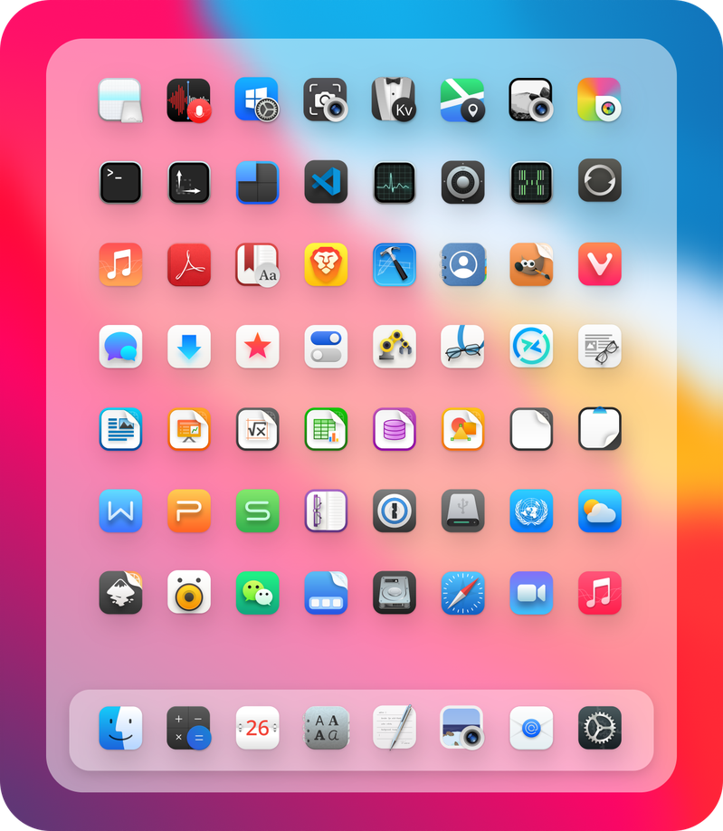
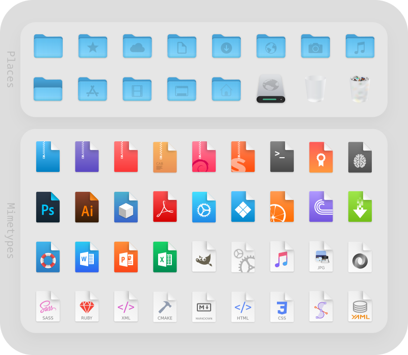

 WhiteSur Icon Theme
======

MacOS Big Sur like icon theme for linux desktops

## Install tips

Usage:  `./install.sh`  **[OPTIONS...]**

|  OPTIONS:           | |
|:--------------------|:-------------|
|-d, --dest           | Specify theme destination directory (Default: $HOME/.themes)|
|-n, --name           | Specify theme name (Default: WhiteSur)|
|-h, --help           | Show this help|

## Requirment
You can use this with:

### GTK theme

WhiteSur-gtk-theme: https://github.com/vinceliuice/WhiteSur-gtk-theme

### KDE theme

WhiteSur-kde: https://github.com/vinceliuice/WhiteSur-kde

## Preview

